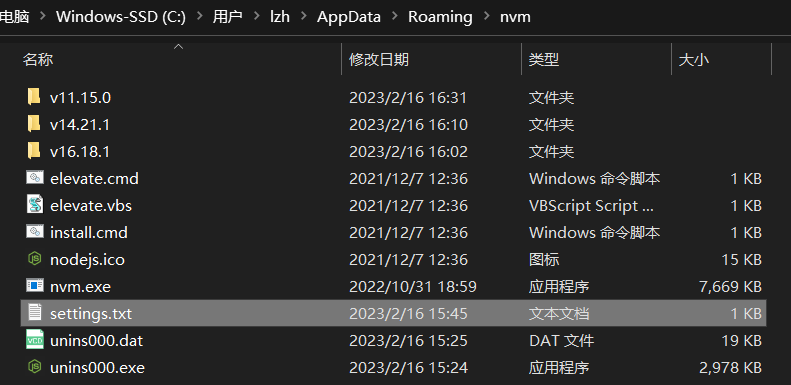

## 升级 node.js 版本后 npm i 报错
问题：更新 node 版本后，有的项目执行 npm install 出现 node-sass 和 python 一系列报错信息  
原因：node.js 和 node-sass 的版本不兼容  

解决: 查看项目 package.json 中 node-sass 的版本，安装与之对应的 node.js，使用 nvm 可以安装管理多个版本的 node  

## 使用 nvm
### 安装
[下载地址](https://github.com/coreybutler/nvm-windows/releases)
### 配置国内源

在 settings 文件中追加
```
node_mirror: https://npmmirror.com/mirrors/node/
npm_mirror: https://npmmirror.com/mirrors/npm/
```
### 相关命令
```
nvm list available
nvm install 版本号
nvm use 版本号
```