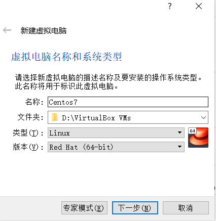
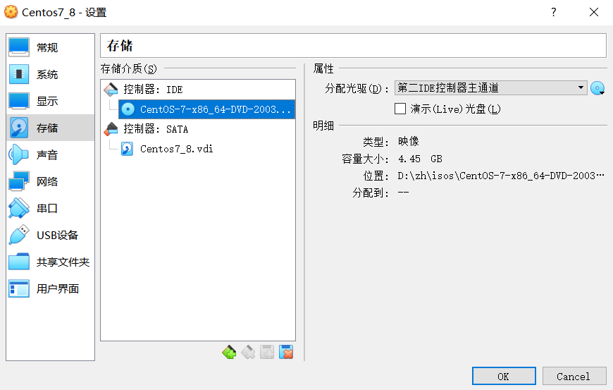
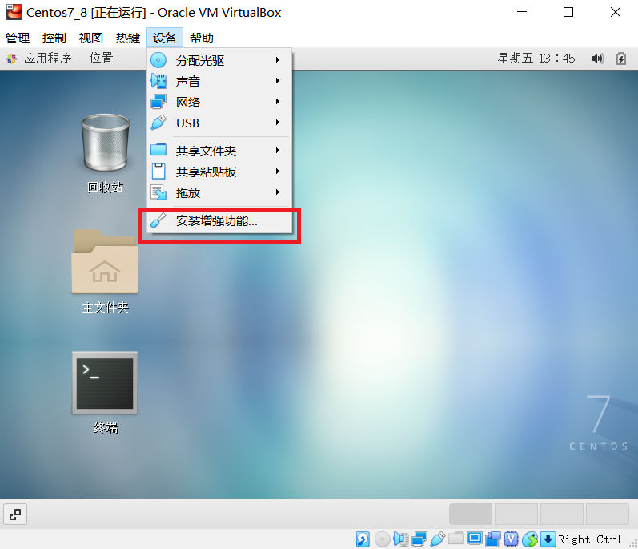

## virtualbox 安装 CentOS7
### 1. 下载系统镜像文件
- [https://www.centos.org/download/mirrors/](https://www.centos.org/download/mirrors/) 
- [官网地址](http://vault.centos.org/) 

### 2. 打开 virtualbox 新建一个虚拟电脑
    

### 3. 设置镜像文件，安装系统
    
- **默认是最小安装，没有图形界面，如果需要图形界面，可以选择`带 GUI 的服务器`**
- **安装系统时可以选择自己配置分区，`/boot`,`swap`,`/` 这几个是必须有的，具体可以搜索相关教程**
- **virtualbox 网络设置默认为`网络地址转换(NAT)`，如果要在外部访问虚拟机，应设置为`桥接网卡`**

### 4. 安装增强功能
    
- **点击`安装增强功能`后，虚拟机系统内会弹出安装提示，点击运行即可**
- **如果安装没有报错，重启系统就可以了，安装了增强功能后可以设置全屏和显示分辨率**
- **遇到一个报错信息:**
```
This system is currently not set up to build kernel modules.
Please install the gcc make perl packages from your distribution.
Please install the Linux kernel "header" files matching the current kernel
```
- **解决：在终端执行以下命令**
```
yum install gcc make perl
yum install kernel-devel-$(uname -r)
rpm -qa kernel\*
```