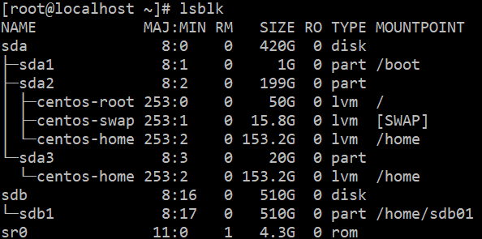
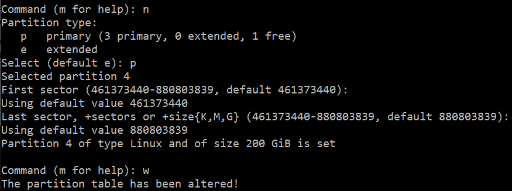
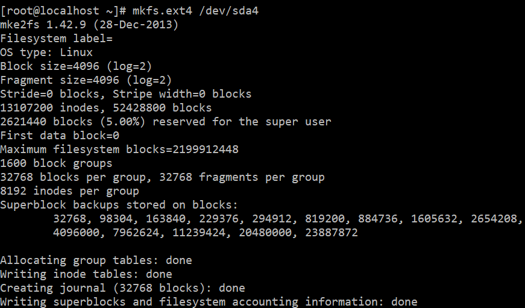
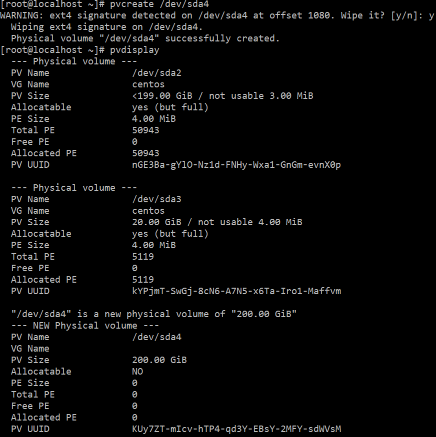
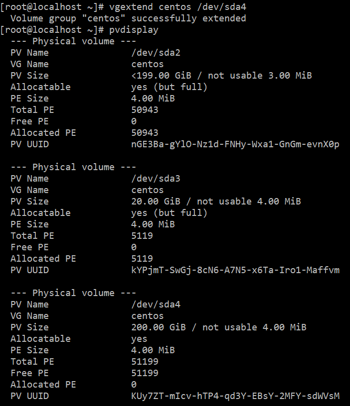
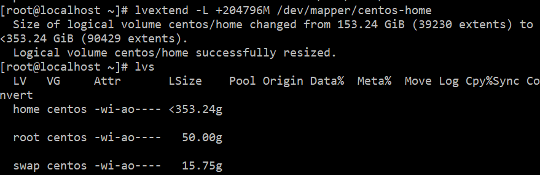
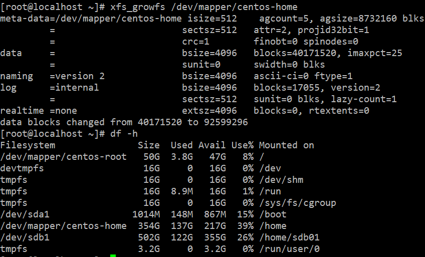

## vmvare 虚拟机 centos7 扩展磁盘空间

1. 在虚拟机设置中增加磁盘容量，重启系统
2. lsblk 可以看到磁盘空间已经增加  
   

3. fdisk /dev/sda 把新加的磁盘空间分区  
   fdisk -l 可以看到新加的分区  
   fdisk /dev/sda t 修改分区的类型为 Linux LVM  
   
4. mkfs.ext4 /dev/sda4 格式化  
   
5. pvcreate  
   
6. vgextend  
   
7. lvextend -L +90G /dev/mapper/centos-root  
   
8. xfs_growfs  
   